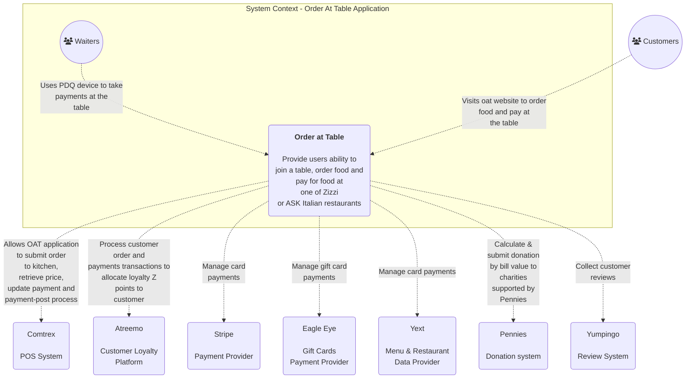
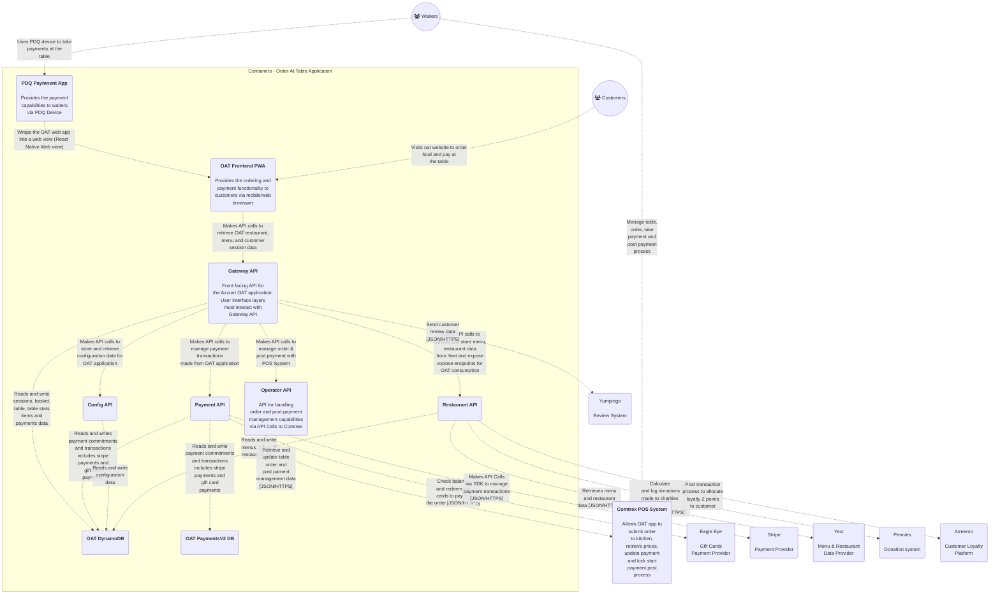
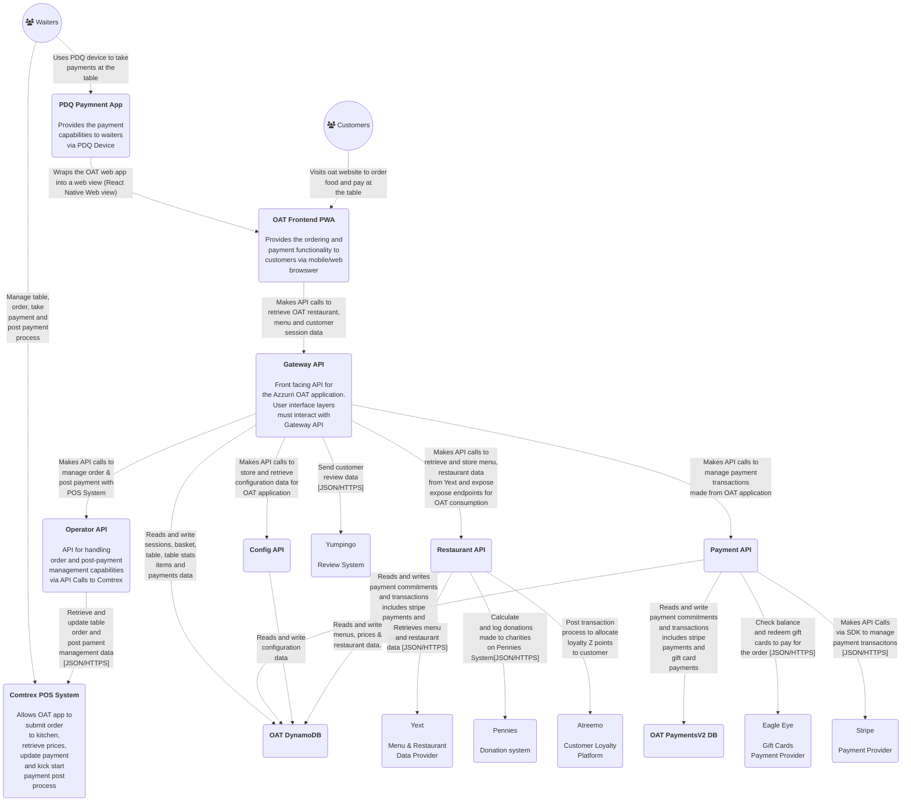
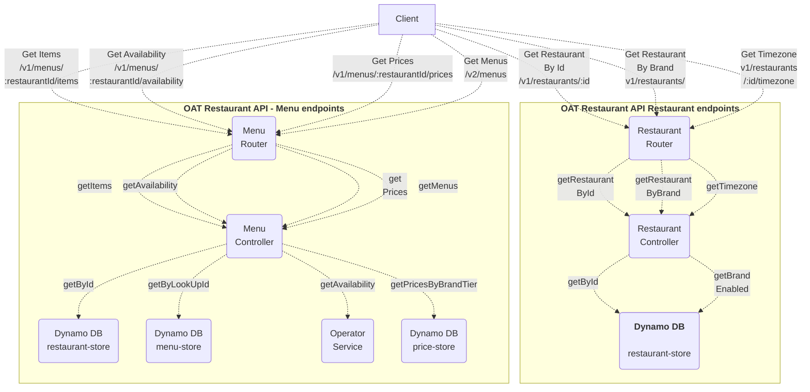
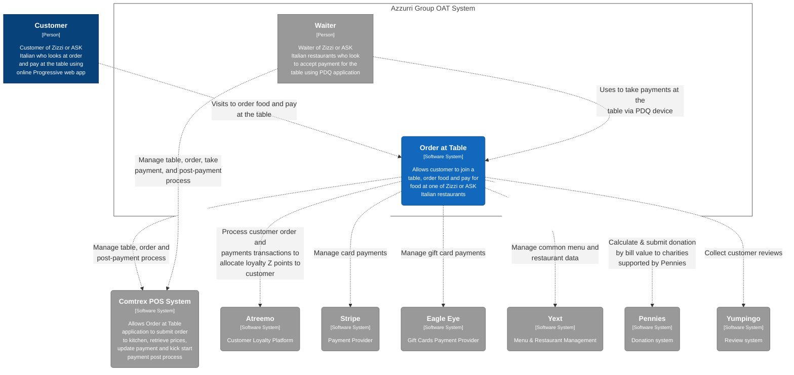
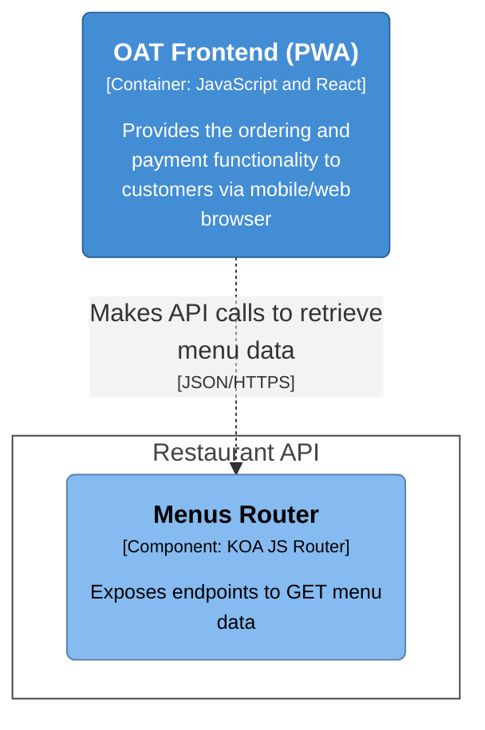
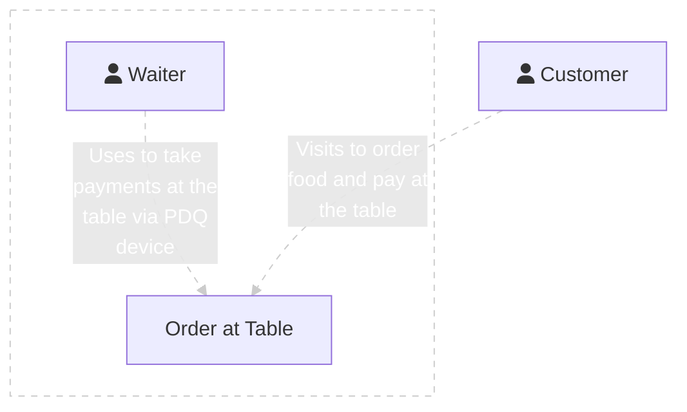

```mermaid
graph TB
  linkStyle default fill:#ffffff

  13("<div style='font-weight: bold'>Comtrex POS System</div><div style='font-size: 70%; margin-top: 0px'>[Software System]</div><div style='font-size: 80%; margin-top:10px'>Allows Order at Table<br />application to submit order<br />to kitchen, retrieve prices,<br />update payment and kick start<br />payment post process</div>")
  style 13 fill:#999999,stroke:#6b6b6b,color:#ffffff
  14("<div style='font-weight: bold'>Atreemo</div><div style='font-size: 70%; margin-top: 0px'>[Software System]</div><div style='font-size: 80%; margin-top:10px'>Customer Loyalty Platform</div>")
  style 14 fill:#999999,stroke:#6b6b6b,color:#ffffff
  15("<div style='font-weight: bold'>Stripe</div><div style='font-size: 70%; margin-top: 0px'>[Software System]</div><div style='font-size: 80%; margin-top:10px'>Payment Provider</div>")
  style 15 fill:#999999,stroke:#6b6b6b,color:#ffffff
  16("<div style='font-weight: bold'>Eagle Eye</div><div style='font-size: 70%; margin-top: 0px'>[Software System]</div><div style='font-size: 80%; margin-top:10px'>Gift Cards Payment Provider</div>")
  style 16 fill:#999999,stroke:#6b6b6b,color:#ffffff
  17("<div style='font-weight: bold'>Yext</div><div style='font-size: 70%; margin-top: 0px'>[Software System]</div><div style='font-size: 80%; margin-top:10px'>Menu & Restaurant Management</div>")
  style 17 fill:#999999,stroke:#6b6b6b,color:#ffffff
  18("<div style='font-weight: bold'>Pennies</div><div style='font-size: 70%; margin-top: 0px'>[Software System]</div><div style='font-size: 80%; margin-top:10px'>Donation system</div>")
  style 18 fill:#999999,stroke:#6b6b6b,color:#ffffff
  19("<div style='font-weight: bold'>Yumpingo</div><div style='font-size: 70%; margin-top: 0px'>[Software System]</div><div style='font-size: 80%; margin-top:10px'>Review system</div>")
  style 19 fill:#999999,stroke:#6b6b6b,color:#ffffff
  1["<div style='font-weight: bold'>Customer</div><div style='font-size: 70%; margin-top: 0px'>[Person]</div><div style='font-size: 80%; margin-top:10px'>Customer of Zizzi or ASK<br />Italian who looks at order<br />and pay at the table using<br />online Progressive web app</div>"]
  style 1 fill:#08427b,stroke:#052e56,color:#ffffff
  2["<div style='font-weight: bold'>Waiter</div><div style='font-size: 70%; margin-top: 0px'>[Person]</div><div style='font-size: 80%; margin-top:10px'>Waiter of Zizzi or ASK<br />Italian restaurants who look<br />to accept payment for the<br />table using PDQ application</div>"]
  style 2 fill:#999999,stroke:#6b6b6b,color:#ffffff

  subgraph 3 [Order at Table]
    style 3 fill:#ffffff,stroke:#444444,color:#444444

    10("<div style='font-weight: bold'>Payment API</div><div style='font-size: 70%; margin-top: 0px'>[Container: JavaScript Microservice]</div><div style='font-size: 80%; margin-top:10px'>API for handling payment made<br />by Order at table payments</div>")
    style 10 fill:#438dd5,stroke:#2e6295,color:#ffffff
    11[("<div style='font-weight: bold'>OAT DynamoDB</div><div style='font-size: 70%; margin-top: 0px'>[Container: NoSQL Database]</div><div style='font-size: 80%; margin-top:10px'>Stores client session, table,<br />table stats, restaurants and<br />payments data</div>")]
    style 11 fill:#438dd5,stroke:#2e6295,color:#ffffff
    12[("<div style='font-weight: bold'>OAT PaymentsV2 DB</div><div style='font-size: 70%; margin-top: 0px'>[Container: SQL Database]</div><div style='font-size: 80%; margin-top:10px'>Stores payments transaction<br />data</div>")]
    style 12 fill:#438dd5,stroke:#2e6295,color:#ffffff
    4("<div style='font-weight: bold'>Progressive Web Application</div><div style='font-size: 70%; margin-top: 0px'>[Container: JavaScript and React]</div><div style='font-size: 80%; margin-top:10px'>Provides the ordering and<br />payment functionality to<br />customers via mobile/web<br />browser</div>")
    style 4 fill:#438dd5,stroke:#2e6295,color:#ffffff
    5("<div style='font-weight: bold'>PDQ Application</div><div style='font-size: 70%; margin-top: 0px'>[Container: Native App]</div><div style='font-size: 80%; margin-top:10px'>Provides the payment<br />capabilities to waiters via<br />PDQ Device</div>")
    style 5 fill:#438dd5,stroke:#2e6295,color:#ffffff
    6("<div style='font-weight: bold'>Gateway API</div><div style='font-size: 70%; margin-top: 0px'>[Container: JavaScript Microservice]</div><div style='font-size: 80%; margin-top:10px'>Front facing API for the<br />Azzurri Group Order at Table<br />application. User Interface<br />layers only interacts with<br />Gateway API</div>")
    style 6 fill:#438dd5,stroke:#2e6295,color:#ffffff
    7("<div style='font-weight: bold'>Config API</div><div style='font-size: 70%; margin-top: 0px'>[Container: JavaScript Microservice]</div><div style='font-size: 80%; margin-top:10px'>Provides capability to<br />retrieve and store<br />configuration data as json<br />payload as a whole or by<br />property</div>")
    style 7 fill:#438dd5,stroke:#2e6295,color:#ffffff
    8("<div style='font-weight: bold'>Restaurant API</div><div style='font-size: 70%; margin-top: 0px'>[Container: JavaScript Microservice]</div><div style='font-size: 80%; margin-top:10px'>API for handling restaurant<br />information like menu,<br />prices, table stats,<br />donation, reviews and<br />provides email capability</div>")
    style 8 fill:#438dd5,stroke:#2e6295,color:#ffffff
    9("<div style='font-weight: bold'>Operator API</div><div style='font-size: 70%; margin-top: 0px'>[Container: JavaScript Microservice]</div><div style='font-size: 80%; margin-top:10px'>API for handling order and<br />post-payment management<br />capabilities via API calls to<br />Comtrex</div>")
    style 9 fill:#438dd5,stroke:#2e6295,color:#ffffff
  end

  2-. "<div>Manage table, order, take<br />payment, and post-payment<br />process</div><div style='font-size: 70%'></div>" .->13
  1-. "<div>Visits oat websiste using<br />mobile/web browswer</div><div style='font-size: 70%'>[HTTPS]</div>" .->4
  2-. "<div>Uses Optomany Payment Device</div><div style='font-size: 70%'>[HTTPS]</div>" .->5
  5-. "<div>Wraps the oat web app into a<br />web view</div><div style='font-size: 70%'>[React Navtive Web View]</div>" .->4
  4-. "<div>Makes API calls to retrieve<br />oat customer state data</div><div style='font-size: 70%'>[JSON/HTTPS]</div>" .->6
  4-. "<div>Makes API calls to retrieve<br />configuration data</div><div style='font-size: 70%'>[JSON/HTTPS]</div>" .->7
  4-. "<div>Makes API calls to complete<br />payment</div><div style='font-size: 70%'>[JSON/HTTPS]</div>" .->15
  6-. "<div>Makes API calls to retrieve<br />and store menu, restaurant<br />dat from Yext and expose<br />endpoints for OAT consumption</div><div style='font-size: 70%'>[JSON/HTTP]</div>" .->8
  6-. "<div>Makes API calls to manage<br />order & post-payment with POS<br />system</div><div style='font-size: 70%'>[JSON/HTTPS]</div>" .->9
  6-. "<div>Makes API calls to manage<br />payment transactions made<br />from OAT application</div><div style='font-size: 70%'>[JSON/HTTPS]</div>" .->10
  6-. "<div>Makes API calls to store and<br />retrieve configuration data<br />for OAT application</div><div style='font-size: 70%'>[JSON/HTTPS]</div>" .->7
  10-. "<div>Makes API calls via SDK to<br />manage payment transactions</div><div style='font-size: 70%'>[JSON/HTTPS]</div>" .->15
  10-. "<div>Reads and writes payment<br />commitments and transactions<br />includes stripe payments and<br />gift card payments</div><div style='font-size: 70%'>[SQL]</div>" .->12
  10-. "<div>Reads and writes payment<br />commitments and transactions<br />includes stripe payments and<br />gift card payments</div><div style='font-size: 70%'>[NoSQL]</div>" .->11
  6-. "<div>Reads and write sessions,<br />basket, table, table stats,<br />items and payments data</div><div style='font-size: 70%'>[NoSQL]</div>" .->11
  7-. "<div>Reads and writes<br />configuration data</div><div style='font-size: 70%'>[NoSQL]</div>" .->11
  8-. "<div>Reads and writes menus prices<br />and restaurants data</div><div style='font-size: 70%'>[NoSQL]</div>" .->11
  8-. "<div>Retrieves menu and restaurant<br />data</div><div style='font-size: 70%'>[JSON/HTTPS]</div>" .->17
  8-. "<div>Post transaction process to<br />allocate loyalty Z points to<br />customer</div><div style='font-size: 70%'>[JSON/HTTPS]</div>" .->14
  8-. "<div>Calculate donation amount on<br />bill value and log donations<br />made to charities on Pennies<br />system</div><div style='font-size: 70%'>[JSON/HTTPS]</div>" .->18
  9-. "<div>Retrieve and update table,<br />order and post-payment<br />management data</div><div style='font-size: 70%'>[JSON/HTTPS]</div>" .->13
  10-. "<div>Check balance and redeem gift<br />cards to pay for the order</div><div style='font-size: 70%'>[JSON/HTTPS]</div>" .->16
  6-. "<div>Send customer review data</div><div style='font-size: 70%'>[JSON/HTTPS]</div>" .->19
```

# OAT Diagrams

# OAT Container Diagram v1

# OAT Container Diagram v2

## OAT Restaurant API - Endpoints summary

```mermaid
%%{init: {'theme':'base','themeVariables': { 'lineColor': '#ffffff', }}}%%
graph TB

  style Atreemo fill:#FDDCDC,stroke:#333,stroke-width:2px,color:#333
  style Yext fill:#FDDCDC,stroke:#333,stroke-width:2px,color:#333
  style PatOperator fill:#FDDCDC,stroke:#333,stroke-width:2px,color:#333
  style PATPayment fill:#FDDCDC,stroke:#333,stroke-width:2px,color:#333
  style Yumpingo fill:#FDDCDC,stroke:#333,stroke-width:2px,color:#333
  style Pennies fill:#FDDCDC,stroke:#333,stroke-width:2px,color:#333

  Client -. "Makes API calls <br/>for menu, menu item<br/> & price data" .-> MenuRouter(Menu<br/>Router)
  Client -. "Makes API calls <br/>for restaurant data" .-> RestaurantRouter(Restaurant<br/>Router)
  Client -. "Get Review Url" .-> YumpingoRouter(Yumpingo<br/>Router)
  Client -. "Send Email" .-> EmailRouter(Email<br/>Router)
  Client -. "Calculate<br/>& Submit donation" .-> DonationRouter(Donation<br/>Router)
  Client -. "Get FAQs" .-> FAQRouter(FAQ<br/>Router)
  Client -. "Post Transaction" .-> StatsRouter(Stats<br/>Router)

  subgraph "FAQs"
    FAQRouter
  end

  subgraph "DynamoDB"
    MenuStore
    PriceStore
    RestaurantStore
  end

  subgraph "Restaurant endpoints"
    RestaurantRouter -. "Makes method calls <br/>to retrieve restaurant<br/>data" .-> RestaurantController(Restaurant<br/>Controller)
  end

  subgraph "Yumpingo endpoints"
    YumpingoRouter -. getReviewUrl .-> YumpingoController(Yumpingo<br/>Controller)
  end

  subgraph "Email endpoints"
    EmailRouter -. "sendEmail" .-> EmailController(Email<br/>Controller)
  end

  subgraph "Donation endpoints"
    DonationRouter -. "calculate<br/>Donation" .-> DonationController(Donation<br/>Controller)
    DonationRouter -. "submit<br/>Donation" .-> DonationController
    DonationController -. "getSuggested<br/>Donation" .-> DonationService(Donation<br/>Service)
    DonationController -. "submit<br/>Donation" .-> DonationService
  end

  subgraph "stats endpoint"
    StatsRouter -. "post<br/>Transaction" .-> StatsController(Stats<br/>Controller)
    StatsController -. "getOrder<br>Snapshot" .-> OperatorService
    StatsController -. "getTransactions" .-> PaymentService(Payment<br/>Service)
    StatsController -. "getAll<br/>Completed<br/>Payments" .-> PaymentService
  end

  subgraph "Menu endpoitns"
    MenuRouter -. "Makes method calls <br/>for menu, menu item<br/> & price data" .-> MenuController(Menu<br/>Controller)
    MenuController -. "getAvailability" .-> OperatorService(Operator<br/>Service)
  end

  MenuController -. "getByLookUpId" .-> MenuStore(DynamoDB<br/>menu-store)
  MenuController -. "getPrices<br/>ByBrandTier" .-> PriceStore(DynamoDB<br/>price-store)
  OperatorService -. "getAvailability" .-> PatOperator(PAT Operator API)
  MenuController -. "getMenu<br/>ItemV3<br/>(getPOSMenuItem)" .-> Yext
  MenuController -. "getMenu<br/>ItemV3<br/>(getItemModifiers)" .-> Yext
  MenuController -. "getById" .-> RestaurantStore("DynamoDB<br/>restaurant-store")

  RestaurantController -. "getById" .-> RestaurantStore
  RestaurantController -. "getRestaurant<br/>ByBrand" .-> RestaurantStore

  YumpingoController -. "getById" .-> RestaurantStore
  YumpingoController -. "getReviewUrl" .-> Yumpingo(Yumpingo<br/>API)

  EmailController -. "getById" .-> RestaurantStore
  EmailController -. "postContact" .-> Atreemo
  EmailController -. "communication<br/>Preference" .-> Atreemo
  EmailController -. "sendElement" .-> Atreemo

  DonationController -. "getById" .-> RestaurantStore
  DonationService -. "sendCalculation<br/>Request" .-> Pennies(Pennies<br/>API)
  DonationService -. "logDonation" .-> Pennies

  StatsController -. "postTransaction" .-> Atreemo

  PaymentService -. "getTransactions" .-> PATPayment(PAT Payment API<br/><br/>pat-payment)
  PaymentService -. "getAll<br/>Completed<br/>Payments" .-> PATPayment


  FAQRouter -. "getFAQs" .-> Yext
```

## OAT Restaurant API - C3 Diagram

## OAT Context Diagram

## OAT Container Diagram

## OAT Restaurant API Component Diagram

## Context Diagram - Mermaid v2

