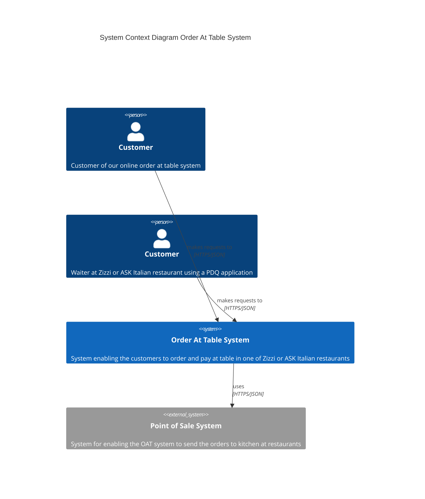

# css-recipes
A collection of css recipes from the w3schools

```mermaid
  C4Context
    title System Context Diagram Order At Table System

    Person(ecommCustomer, Customer, "Customer of our online order at table system")
    Person(pdqWaiter, Customer, "Waiter at Zizzi or ASK Italian restaurant using a PDQ application")
    System(oat, "Order At Table System", "System enabling the customers to order and pay at table in one of Zizzi or ASK Italian restaurants")
    System_Ext(comtrex, "Point of Sale System", "System for enabling the OAT system to send the orders to kitchen at restaurants")

    Rel(ecommCustomer, oat, "makes requests to", "HTTPS/JSON")
    Rel(pdqWaiter, oat, "makes requests to", "HTTPS/JSON")
    Rel(oat, comtrex, "uses", "HTTPS/JSON")
    
    UpdateLayoutConfig($c4ShapeInRow="1", $c4BoundaryInRow="1")
```
