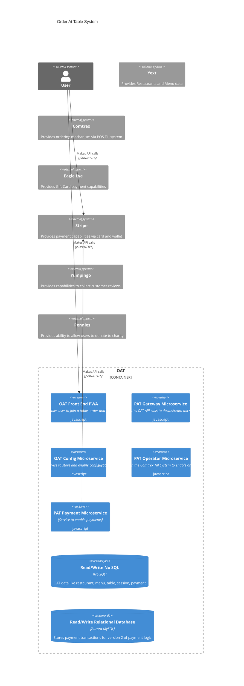

```mermaid
C4Container
title Order At Table System

Person_Ext(person_ext_public, "User")
Container_Boundary(Azzurri, "OAT") {
  Container(oat_front_end, "OAT Front End PWA", "Enables user to join a table, order and pay", "javascript")
  Container(pat_gateway, "PAT Gateway Microservice", "Orchestrates OAT API calls to downstream microservices", "javascript")
  Container(oat_config, "OAT Config Microservice", "Service to store and enable configuration", "javascript")
  Container(pat_operator, "PAT Operator Microservice", "Communicates with the Comtrex Till System to enable ordering mechanism", "javascript")
  Container(pat_payment, "PAT Payment Microservice", "Service to enable payments", "javascript")
  
  ContainerDb(DynamoDB, "Read/Write No SQL", "No SQL", "OAT data like restaurant, menu, table, session, payment")
  ContainerDb(Aurora, "Read/Write Relational Database", "Aurora MySQL", "Stores payment transactions for version 2 of payment logic")
}

System_Ext(system_ext_Yext, "Yext", "Provides Restaurants and Menu data")
System_Ext(system_ext_Comtrex, "Comtrex", "Provides ordering mechanism via POS Till system")
System_Ext(system_ext_Eagleeye, "Eagle Eye", "Provides Gift Card payment capabilities")
System_Ext(system_ext_Stripe, "Stripe", "Provides payment capabilities via card and wallet")
System_Ext(system_ext_Yumpingo, "Yumpingo", "Provides capabilities to collect customer reviews")
System_Ext(system_ext_Pennies, "Pennies", "Provides ability to allow users to donate to charity")


Rel(person_ext_public, oat_front_end,  "Makes API calls", "JSON/HTTPS")
Rel(person_ext_public, system_ext_Stripe,  "Makes API calls", "JSON/HTTPS")
Rel(pat_payment, system_ext_Stripe,  "Makes API calls", "JSON/HTTPS")

UpdateLayoutConfig($c4ShapeInRow="2", $c4BoundaryInRow="1")
```
