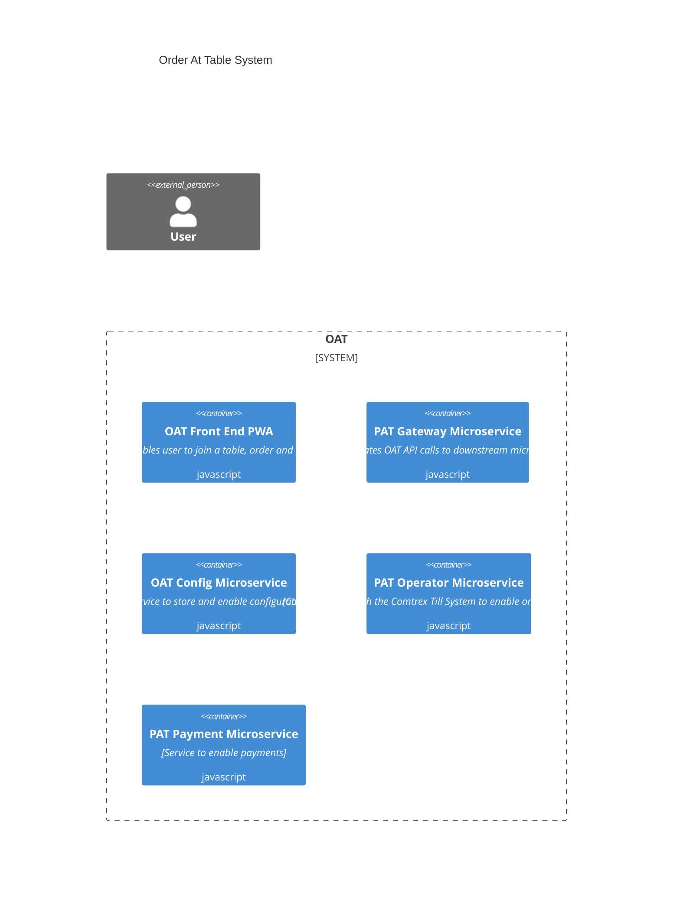

```mermaid
C4Container
title Order At Table System

Person_Ext(person_ext_public, "User")
System_Boundary(Azzurri, "OAT") {
  Container(oat_front_end, "OAT Front End PWA", "Enables user to join a table, order and pay", "javascript")
  Container(pat_gateway, "PAT Gateway Microservice", "Orchestrates OAT API calls to downstream microservices", "javascript")
  Container(oat_config, "OAT Config Microservice", "Service to store and enable configuration", "javascript")
  Container(pat_operator, "PAT Operator Microservice", "Communicates with the Comtrex Till System to enable ordering mechanism", "javascript")
  Container(pat_payment, "PAT Payment Microservice", "Service to enable payments", "javascript")
}

```
